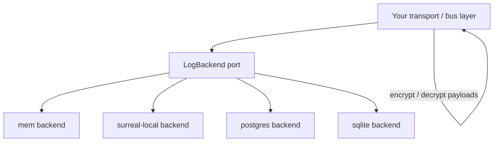

# Continuum

[](https://github.com/deathbreakfast/continuum/actions/workflows/ci.yml)
[](LICENSE)

**Continuum** is a Rust append-only transport log for services that need durable publish, replay, and fanout. A thin [`LogBackend`](continuum-core/src/backend/log_backend.rs) port with feature-gated storage backends — sequenced partitions, idempotent appends, and consumer checkpoints — without locking you into one database or a full message broker.

*A dependency-light persistence port for high-throughput event transport.*

**Status:** v0.1.0 early release · [MIT](LICENSE) · [GitHub](https://github.com/deathbreakfast/continuum)

**Requires:** nightly Rust ([`rust-toolchain.toml`](rust-toolchain.toml)) — stable is not supported yet.

**Performance (see [study](continuum-bench/PERFORMANCE_STUDY.md)):** in-process `mem` ~100k ops/s; durable sqlite ~2k ops/s on burstable cloud instances.

## Why Continuum

| Pain | Continuum answer |
|------|------------------|
| Reinventing append/read/checkpoint logic per project | Thin async port — batch `append` and `read_from` |
| Tight coupling to one database | Feature-gated backends behind one trait |
| Consumer replay and fanout | Per-subscription durable checkpoints |
| Duplicate delivery | Idempotent append on `event_id` |
| Payload security | Store opaque bytes; encrypt and decrypt above the port |

A **stream** ([`LogStreamId`](continuum-core/src/types/stream.rs)) identifies a partition: destination + topic + optional key. Each stream has strictly increasing sequence numbers. A **checkpoint** records how far a consumer has read, so restarts resume without reprocessing from the beginning.

## Architecture



Your application owns encryption, routing policy, and business logic. Continuum owns append-only storage semantics: sequences, dedupe, and checkpoints.

## Quick start

Add the facade crate with the in-memory backend for local evaluation:

```toml
[dependencies]
continuum = { git = "https://github.com/deathbreakfast/continuum", features = ["mem"] }
tokio = { version = "1", features = ["rt-multi-thread", "macros"] }
uuid = { version = "1", features = ["v4"] }
```

```rust
use continuum::backends::InMemoryLogBackend;
use continuum::backend::LogBackend;
use continuum::types::{AppendRecord, LogBackendKind, LogDestination, LogStreamId, Seq};
use uuid::Uuid;

#[tokio::main]
async fn main() -> Result<(), continuum::LogError> {
    let backend = InMemoryLogBackend::new();
    let stream = LogStreamId::new(
        LogDestination::new("default", LogBackendKind::Memory),
        "events",
        None,
    );

    let record = AppendRecord::new(Uuid::new_v4(), vec![1, 2, 3]);
    let seqs = backend.append(stream.clone(), &[record]).await?;
    println!("appended at seq {}", seqs[0].0);

    let events = backend.read_from(stream, Seq::ZERO, 10).await?;
    println!("read {} event(s)", events.len());
    Ok(())
}
```

Enable features explicitly — the facade ships with **no default features** (`default = []`). See [Cargo features](#cargo-features) below.

API details: [`continuum/README.md`](continuum/README.md) and `cargo doc -p continuum --open`.

## Cargo features

| Feature | Backend | Status |
|---------|---------|--------|
| `mem` | In-memory | Ready — tests and local dev |
| `surreal-local` | SurrealDB (injected handle) | Ready — production path |
| `postgres` / `sqlite` | SQL engines | Ready — PostgreSQL and SQLite transport log |
| `telemetry-console` | Console instrumentation | Optional |
| *(none)* | Port + DTOs + router only | `default-features = false` |

Production wiring: **Surreal-local** injects a handle from your host; **PostgreSQL** and **SQLite** backends open their own connection pools. See [backend wiring](continuum/README.md#backend-wiring) in the crate README.

## When to use it

**Good fit**

- Transport persistence, replay, and reprocessing
- Partitioned event streams with strict per-stream ordering
- Systems that need a storage port, not a full message broker

**Not a fit**

- Canonical system-of-record or classified data storage
- Schema ORM, privacy evaluation, or query layers
- User-facing ops UI (build projection tables above the log)

Scale-oriented design notes (batched tailers, compaction, shared fanout) are documented on [`LogBackend`](continuum-core/src/backend/log_backend.rs) in rustdoc — not all optimizations ship in v0.1.0.

## Workspace

| Crate | Role |
|-------|------|
| `continuum` | Public facade (re-exports) |
| `continuum-core` | Port, DTOs, router |
| `continuum-telemetry` | `TelemetrySink`, console instrumentation |
| `continuum-backend-*` | Per-engine `LogBackend` implementations |
| `continuum-backend-sql-common` | Shared SQL implementation (postgres + sqlite) |
| `continuum-bench` | Synthetic benchmarks |

## Verify

```bash
cargo test --workspace
cargo check -p continuum --no-default-features
cargo clippy --workspace --all-targets -- -D warnings
cargo outdated --root-deps-only --workspace
```

CI runs on every push and pull request to `main` (see [`.github/workflows/ci.yml`](.github/workflows/ci.yml)).

## Documentation

| Doc | Audience |
|-----|----------|
| `cargo doc -p continuum --open` | Architecture, API reference, examples |
| [`continuum/README.md`](continuum/README.md) | Feature flags and backend wiring |
| [`continuum-bench/PERFORMANCE_STUDY.md`](continuum-bench/PERFORMANCE_STUDY.md) | Performance study and scale analysis |
| [`continuum-bench/EXPERIMENTS.md`](continuum-bench/EXPERIMENTS.md) | Benchmark registry and run commands |

## Contributing

| Doc | Purpose |
|-----|---------|
| [`CONTRIBUTING.md`](CONTRIBUTING.md) | Development setup, verify commands, PR expectations |
| [`SECURITY.md`](SECURITY.md) | Report vulnerabilities privately |
| [`CODE_OF_CONDUCT.md`](CODE_OF_CONDUCT.md) | Community standards |
