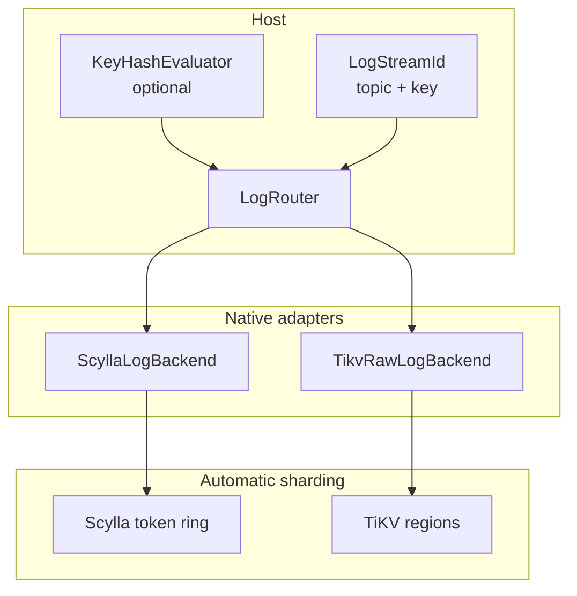
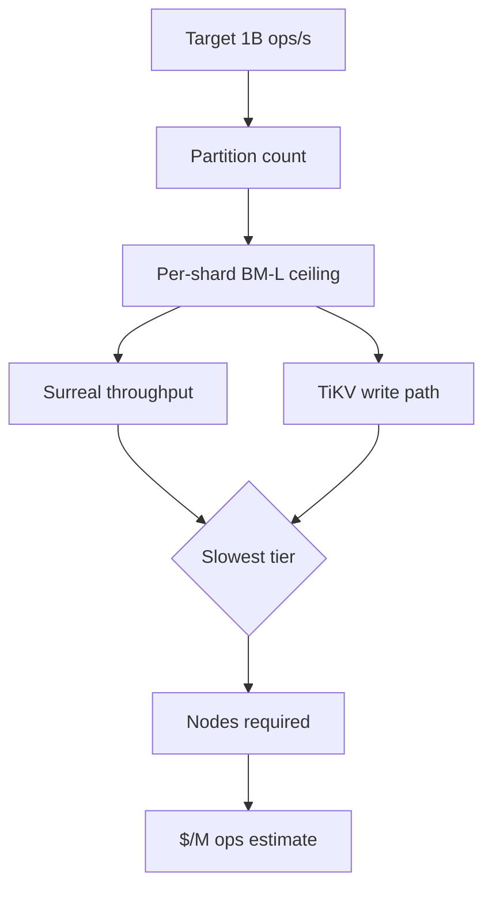
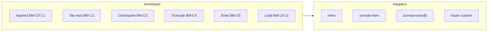

# Continuum Transport Log Performance Across Storage Adapters

**Performance study** — standalone document. Full methodology and interpretation live here; [`EXPERIMENTS.md`](EXPERIMENTS.md) is the pre-registered experiment log and runner reference.

> **Summary for adopters:** need \~2k durable ops/s on a modest cloud instance → **sqlite** (\~$0.003/M ops on t3.small). need \~100k/s in-process ceiling → **mem** (non-durable). Need distributed fleet-scale append → **scylla** with partition keys (\~3–4k ops/s/cluster with idempotent identity, \~24–31k without). **surreal-rocksdb** works for many paths but fails long-run soak on burstable instances. **Start with the decision tables in [§0](#0-decision-guide-read-this-first)**; full methodology follows.

---

## Abstract

Continuum is a Rust append-only transport log: a thin async storage port (`LogBackend`) with feature-gated backends, strictly increasing per-stream sequences, idempotent append, consumer checkpoints, and truncate-for-reclaim. This study evaluates whether the port and its storage adapters exhibit scaling behavior compatible with fleet-scale event transport—including replay and recovery paths on durable storage.

We present a pre-registered synthetic benchmark suite (BM-C0–C6, BM-L0–L3) spanning append latency, batch throughput, tail read at depth, checkpoint churn, truncate reclaim, co-tenancy, long-run soak, and sustained load tiers. **All headline results are measured on rentable AWS instances that anyone can reproduce** — burstable `t3.small`, `t3.medium`, and `t4g.medium` for the embedded/SQL adapters, and `t3.medium` clusters (1–4 nodes) for the native distributed adapters (`scylla`, `tikv-raw`).

On AWS burstable instances, sqlite sustains \~1.9k ops/s with flat replay at 100k depth and stable checkpoints; postgres \~250/s on ARM (valid baseline); `mem` hits \~100k ops/s but fails the replay-at-depth ratio criterion. Best durable cost per operation among general-purpose adapters: `t3.small` + sqlite (\~$0.0031 per 1M ops, compute only). Native `scylla` reaches \~3–4k ops/s per cluster with idempotent identity (\~24–31k without), the cheapest durable path at scale. surreal-rocksdb fails 1 h soak on burstable cloud. A single-box WSL2 lab run (Appendix A) is retained only as early method validation — not as a hardware baseline.

**Keywords:** append-only log, storage port, replay, recovery, checkpoint, benchmark, SurrealDB, RocksDB, transport persistence

---

## 0. Decision guide (read this first)

Throughput and cost depend on three choices: **which adapter**, whether appends are **identity-deduplicated** (exactly-once vs at-least-once), and **how many storage nodes / partitions**. The tables below consolidate the study's canonical results so an engineer can size a deployment without reading the full paper; each links to its drill-down appendix.

**Canonical basis:** native distributed rows are spread-key **BM-M4** aggregate ops/s on `aws-t3-medium` (2 vCPU) with default config (topic-index cache on), post-optimization (July 2026). Embedded/SQL rows are sustained **BM-L2/L3** on the same instance class. All `$/M ops` are compute-only, us-west-2 on-demand: `($/hr ÷ ops/s) × 1e6/3600`; clusters billed per node (t3.medium $0.0416/hr, t3.small $0.0208, t4g.medium $0.0336).

### Table 0.1 — Backend selection guide

| Adapter | Durable | Hot-stream ceiling (1 partition) | Spread-key scale ceiling (1 node) | Best $/M ops | Watch out for | Use when |
|---------|---------|----------------------------------|-----------------------------------|--------------|---------------|----------|
| `mem` | No | \~100k/s | n/a (in-process) | \~$0.0001 | lost on restart; replay-at-depth FAIL (BM-C2) | tests, non-durable cache, ceiling sizing |
| `sqlite` | Yes | \~1.9k/s | — (single node) | \~$0.0031 | truncate read regression on ARM (BM-C4 t4g) | best $/op durable log, one machine, ≤\~1.9k/s |
| `postgres` | Yes | \~250/s | — | \~$0.038 | low ceiling on burstable | reuse existing Postgres, low volume |
| `surreal-rocksdb` | Yes | \~340–440/s | — | \~$0.029 | 1 h soak growth FAIL (BM-C6); OOM ≤2 GiB | embedded when SurrealDB already in stack; short-lived logs |
| `scylla` | Yes | \~184/s (post-opt) | 3.1k id-on / 24k+ id-off | \~$0.0005 (id-off) | LWT-bound; needs partition keys to scale | distributed fleet append with partitioned keys |
| `tikv-raw` | Yes | \~138/s (post-opt) | \~1.2k/node | \~$0.0096 | \~1.1k/s single-client plateau | distributed KV without SurrealDB |

The distributed **`surreal-tikv`** path (\~40 ops/s, \~$0.25/M ops) is not recommended and is excluded from the decision tables — see [Appendix E](#appendix-e--distributed-surrealtikv-extra-data) for the data.

Detail: embedded/SQL → §5.3, §5.5, Appendix D; native distributed → Appendix F (single node), Appendix G (topology).

### Table 0.2 — Cost per 1M operations (compute-only, ascending)

| Config | Instance / nodes | ops/s | $/M ops | Durable |
|--------|------------------|-------|---------|---------|
| `mem` L3 | t4g.medium | 99,998 | $0.00009 | No |
| `scylla` spread, identity off | t3.medium ×1 | 24,279 | $0.00048 | Yes |
| `scylla` spread, identity off | t3.medium ×2 | 30,682 | $0.00075 | Yes |
| `sqlite` L2 | t3.small | 1,885 | $0.0031 | Yes |
| `scylla` spread, identity on | t3.medium ×1 | 3,112 | $0.0037 | Yes |
| `sqlite` L2 | t4g.medium | 1,928 | $0.0048 | Yes |
| `tikv-raw` spread | t3.medium ×1 | 1,201 | $0.0096 | Yes |
| `surreal-rocksdb` load tier | t3.medium | \~400 | $0.029 | Yes |
| `postgres` L2 | t4g.medium | 246 | $0.038 | Yes |

Detail: Appendix D (Table D-cost), Appendix F/G (native). The distributed `surreal-tikv` path (43.5 ops/s, $0.266/M ops) is excluded here — Appendix E holds it as extra data.

### Table 0.3 — Feature / knob throughput cost

| Feature / knob | Change | Throughput effect | Source |
|----------------|--------|-------------------|--------|
| Batching | batch 1 → 1000 | sqlite \~1.95k → \~4.1k/s (\~2×); mem \~213k → \~690k/s; native \~25× | BM-C1 |
| Identity (idempotent dedupe) | LWT exactly-once → none at-least-once | Scylla \~3.1k → \~14.2k/s (\~4.5×); round trips/append 3.03 → 2.03 | Track Z1 |
| Topic-index cache (L2, default **on**) | off → on | removes \~1 RT/append; 2n identity-off \~24k → \~31k/s (\~1.3×) | Track Z2 / AA |
| Telemetry | off → console | negligible (BM-C0 surreal-rocksdb 8.3 → 8.4 ms p50) | BM-C0 / BM-L1 |
| Write consistency (RF>1) | quorum → one | inert at RF=1; durability tradeoff at RF>1 | Track Z4 |
| Seq block size / pipelining / pool-per-shard | tune | no material effect (pipelining + pool-per-shard removed) | Tracks Y / Z3 / Z5 |

Detail: Appendix H (Scylla lever catalog + verdicts).

### Table 0.4 — Topology deployment guide (native distributed, `aws-t3-medium`)

| Storage | Nodes | Peak ops/s (id on) | Peak ops/s (id off) | ops/s per node (id on) | vs 1n | $/mo @1M/s (id on) | $/mo @1M/s (id off) |
|---------|-------|--------------------|--------------------|------------------------|-------|--------------------|--------------------|
| `scylla` | 1 | 3,112 | 24,279 | 3,112 | 1.00× | $9,779 | $1,275 |
| `scylla` | 2 | 3,636 | 30,682 | 1,818 | 1.17× | $16,763 | $2,004 |
| `scylla` | 4 | 3,987 | 29,583 | 997 | 1.28× | $30,489 | $4,130 |
| `tikv-raw` | 1 | 1,201 | n/a† | 1,201 | 1.00× | $25,296 | — |
| `tikv-raw` | 2 | 1,608 | n/a† | 804 | 1.34× | $37,778 | — |
| `tikv-raw` | 4 | 1,620 | n/a† | 405 | 1.35× | $75,070 | — |

† `tikv-raw` has no identity toggle — appends use a transactional write path; there is no LWT to disable.

### Table 0.5 — Topic fan-out (Scylla BM-M5, T=64 topics, L2 on)

Spreading writes across many **topics** is an alternative to spreading across partition keys (Table 0.4). Both behave the same way — identity is the gate, not the spreading method.

| Topology | Identity on (ops/s) | Identity off (ops/s) |
|----------|---------------------|----------------------|
| `scylla` ×1 | 3,699 | 23,412 |
| `scylla` ×2 | 3,831 | 31,257 |
| `scylla` ×4 | not run (id-on) | 34,133 |

- **With identity on**, fan-out across 8–64 topics stays flat at \~3.5–4.1k ops/s (same LWT ceiling as single-topic key-spread, BM-M4) — topics do **not** break the LWT bound.
- **With identity off**, topic fan-out scales like key-spread: 23k (1n) → 31k (2n) → 34k (4n), matching/exceeding raw `cassandra-stress`.
- **Takeaway:** to scale a single hot topic, either spread partition keys or fan out topics — but the \~5–9× jump only comes from turning identity off (at-least-once). Full matrix (T=1/8/64, L2 on/off): [`EXPERIMENTS.md`](EXPERIMENTS.md) Table P5.1 / AA.1, and Appendix H.4.

**Topology recommendations:**

- **Scylla scales sub-linearly** (coordination/bench-bound on `t3.medium`, not storage-saturated — Appendix H). At identity-on, per-node efficiency falls fast: 4 nodes cost \~3× more at 1M/s for only \~6% more peak → **prefer 1–2 nodes**. Identity-off shifts the sweet spot to **2 nodes** (best $/op) but requires at-least-once tolerance.
- **TiKV** gains \~34% from 1→2 nodes, then flattens; 4 nodes nearly doubles cost for \~1% more peak → **prefer 1–2 nodes**.
- To exceed \~30k/s (Scylla) or \~1.6k/s (TiKV) per cluster on this instance class, **add clusters/partitions (fleet-out)** rather than nodes-per-cluster, or move to a larger instance class (Phase 5, deferred — Appendix G.2).

**Quick picks:**

- Low-volume durable (≤\~1.9k ops/s), one machine, best $/op → **`sqlite`**.
- Non-durable ceiling / caches / sizing → **`mem`**.
- Distributed fleet append → **`scylla`** with partition keys (identity-on \~3–4k ops/s/cluster; identity-off \~24–31k).
- Distributed KV without SurrealDB → **`tikv-raw`** (\~1.2k ops/s/node, plateaus).
- Avoid the distributed **`surreal-tikv`** path (\~40 ops/s, \~$0.25/M ops) — kept as extra data in [Appendix E](#appendix-e--distributed-surrealtikv-extra-data) only.

---

## 1. Introduction

### 1.1 Problem

Services that need durable publish, replay, and fanout without adopting a full message broker often reinvent append/read/checkpoint logic per project. Continuum extracts that into a single async port with pluggable storage backends ([`LogBackend`](../continuum-core/src/backend/log_backend.rs)).

### 1.2 Motivation

Fleet-scale event transport implies **very high aggregate throughput**—on the order of **\~1B events/s** summed across partitions and nodes—plus stable tail latency, bounded checkpoint cost, reclaim under churn, and the ability to **recover and replay** after machine or site failure when data lives on durable backends. This paper evaluates whether Continuum’s **port contract and adapter implementations** exhibit scaling characteristics that could support that volume class when horizontally partitioned.

The same benchmark suite serves **smaller deployments** on cost-effective hardware: adopters need a direct answer—*given my expected ops/s and replay depth, can this modest machine handle the load?* The analysis is **product-agnostic**: no dependency on any particular consumer or upstream system.

### 1.3 Research questions

1. How does append throughput scale with batch size per adapter?
2. Does tail-read latency stay flat as stream depth grows to 100k rows (**replay / fanout read path**)?
3. Are checkpoint and truncate paths stable under churn (**consumer resume after restart**)?
4. What sustained ops/s and p99 can each adapter hold before error rate or latency degrades?
5. Does long-run growth (1 h soak at 1 op/s) stay bounded relative to an idle baseline?
6. On **durable** adapters, can consumers **recover and replay** efficiently—i.e. forward read from a checkpoint (or stream start) without pathological latency growth—after a process or node failure? *(Multi-datacenter failover and geo-replication are host/backend deployment concerns; this paper measures port-level replay and checkpoint performance, not cross-DC replication.)*

### 1.4 Scope

- **In scope:** Continuum-only harness (`continuum-bench`); adapters `mem`, `surreal-mem`, `surreal-rocksdb`, `sqlite`, `postgres`, **`scylla`** (native CQL), **`tikv-raw`** (PD client, no Surreal). The distributed `surreal-tikv` path is measured but kept as extra data only (Appendix E).
- **Out of scope:** In-repo competitor harnesses; `stub` telemetry (not implemented); claiming current systems reach 1B/s aggregate; BM-R0 reopen-after-crash (future).

### 1.5 Contributions

- **Cloud baseline on rentable AWS instances** (cost-effective tier): throughput, replay/checkpoint/truncate paths, and $/op sizing on `aws-t3-*` and `aws-t4g-medium` (Appendix D) — the primary, reproducible hardware reference.
- **Native distributed baseline** on `aws-t3-medium` clusters (`scylla`, `tikv-raw`), 1–4 nodes, with identity and topology cost tables (§0, Appendix F/G).
- Consolidated methodology for adapter comparison across a tiered hardware matrix.
- Analytical framework linking workloads to fleet-scale requirements (§3, §5).
- A single-box WSL2 lab run (Appendix A) as early method validation only.

---

## 2. System model

### 2.1 Continuum port

A **stream** ([`LogStreamId`](../continuum-core/src/types/stream.rs)) is destination + topic + optional key. The port provides:

| Operation | Role |
|-----------|------|
| `append` | Batch append; strictly increasing seq per stream; idempotent on `event_id` |
| `read_from` | Forward read after cursor — **replay** of stored events |
| `commit_checkpoint` / `load_checkpoint` | Durable consumer cursor per subscription — **resume** after restart without reprocessing from seq 0 |
| `truncate_before` | Logical reclaim after delivery ack |

**Replay and recovery (port semantics):**

- After a **process crash**, a durable backend (`surreal-rocksdb`, remote Surreal, future adapters) retains appended events; a new process reconnects to the same store, `load_checkpoint` returns the last committed seq, and `read_from` continues forward (at-least-once; dedupe on `event_id`).
- After **node or datacenter loss**, recovery requires **durable storage that survives the failure** (replicated disk, remote database, backup restore)—Continuum defines the replay *interface*; replication and failover are configured at the backend/host layer, not inside the port.
- **`mem` / `surreal-mem`** do not survive process restart; they are not recovery targets for disaster scenarios.

Payloads are opaque ciphertext; encryption is above the port ([`README.md`](../README.md)).

### 2.2 Storage adapters under test

| Adapter | Engine path | Role in study |
|---------|-------------|---------------|
| `mem` | In-memory `HashMap` | Algorithmic ceiling (non-durable) |
| `surreal-mem` | SurrealDB `mem://` | Engine overhead without disk |
| `surreal-rocksdb` | SurrealDB `rocksdb://{tempdir}` | Durable embedded path |
| `surreal-tikv` | Remote SurrealDB → TiKV (`CONTINUUM_BENCH_SURREAL_URL`) | *Extra data only* — poor throughput (\~40/s); see Appendix E |
| **`scylla`** | Native ScyllaDB CQL (`continuum-backend-scylla`) | Purpose-built distributed adapter; LWT seq per partition |
| **`tikv-raw`** | Native TiKV transactional KV (`continuum-backend-tikv-raw`) | Direct PD client; single txn per append batch |
| postgres | Supported when `CONTINUUM_BENCH_POSTGRES_URL` set | Requires external Postgres |
| sqlite | Supported | Embedded temp file in matrix |

> The **distributed Surreal→TiKV** path (`surreal-tikv`) delivered poor throughput (\~40 ops/s) and is **not part of the main study** — it is retained as extra data in [Appendix E](#appendix-e--distributed-surrealtikv-extra-data) and [`EXPERIMENTS.md`](EXPERIMENTS.md). The native distributed adapters below (`scylla`, `tikv-raw`) are the recommended fleet-scale path.

### 2.6 Native distributed adapters (Scylla + raw TiKV)

For fleet-scale campaigns, Continuum ships **native** adapters that collapse append to one logical write path per batch (vs 3–4 sequential queries on SQL/Surreal paths):

```
Host (LogStreamId.key)  →  ScyllaLogBackend / TikvRawLogBackend  →  token ring / TiKV regions
```

| Layer | Mechanism | Owner |
|-------|-----------|-------|
| Logical partition | `LogStreamId.key` → `storage_key()` | App / caller |
| Multi-cell (optional) | `KeyHashEvaluator`: `hash(key) % N` → `LogDestination` | Host at boot |
| Physical shard | Scylla partition key / TiKV key prefix | Storage engine |

**One cluster = one backend instance** (contact points or PD endpoint); drivers route by `stream_key`. Scale out cells only when a single cluster saturates — register N backends and use `KeyHashEvaluator`.

Benchmarks: `native-lab` (parity vs sqlite), `native-scale` (BM-P1/P2/M1/M2 partition and client sweeps). Infra: [`infra/scylla/`](../infra/scylla/), [`infra/tikv-raw/`](../infra/tikv-raw/), [`infra/native-aws/`](../infra/native-aws/) (AWS t3.medium campaigns).

**aws-t3-medium Phase A (July 2026):** colocated `scylla-1` and `tikv-minimal` on separate t3.medium hosts. Native C1 batch throughput **\~1.6–1.8k/s** (≈ sqlite); hot-stream L3 **\~64/s scylla**, **\~45/s tikv-raw** without partition keys. See Appendix F and [`EXPERIMENTS.md`](EXPERIMENTS.md) native-lab section.



Fleet projection: `partitions_for_1e9 = ceil(1e9 / per_partition_ceiling)` using BM-L3 (single-partition ceiling) and BM-M2 (multi-client aggregate) from `project-fleet --storage scylla|tikv-raw`.

### 2.3 Topology

| Topology | Meaning |
|----------|---------|
| `isolated-lab` | Fresh backend per experiment |
| `shared-handle` | Shared Surreal handle (BM-C5 co-tenancy) |
| `remote-surreal` | Remote URL via `CONTINUUM_BENCH_SURREAL_URL` (not run in lab matrix) |

### 2.4 Workload constants

- Payload: **256 B** ciphertext per record
- Telemetry: `off` (primary); `console` on BM-C0 and BM-L1 for overhead comparison
- Read limit cap: **10,000** rows per `read_from` call (port validation)

---

## 3. Target scale analysis (aspirational)

Fleet-scale aggregate target: **\~1B events/s** across the fleet. This section decomposes requirements on the **storage port**—not a performance claim.

### 3.1 Partitioning

Single hot partitions cannot absorb 1B/s. Required shape:

| Partitions | Implied mean rate per partition |
|------------|----------------------------------|
| 1 | 1B/s (infeasible single-stream) |
| 1,000 | 1M/s |
| 1,000,000 | 1k/s |

Continuum sequences are **per-stream**; fleet scale assumes many streams/keys and many nodes.

### 3.2 Per-operation budgets

At 1M/s per hot shard with batch size 1000 → **1k append calls/s** per shard. BM-C0/C1 establish per-call and per-batch floors. Tail fanout and **replay reads** (BM-C2) and **checkpoint resume** (BM-C3) must stay flat at depth. Truncate (BM-C4) must not destabilize reads post-reclaim.

### 3.3 Recovery and replay at scale

Failure scenarios decompose into port-level vs infrastructure-level:

| Scenario | Continuum port | Backend / ops requirement |
|----------|----------------|---------------------------|
| Consumer restart | `load_checkpoint` + `read_from` | Durable backend handle |
| Publisher/process restart | Reconnect; events readable after crash | Durable backend (not `mem`) |
| Single node loss | Same as above if store is remote/replicated | HA storage, failover |
| Datacenter loss | Replay possible **after** store is restored/replicated elsewhere | Geo-replication, backup, RTO/RPO targets |

Research question 6 and workloads BM-C2/C3 proxy **replay and resume cost** on a live store; a dedicated **reopen-after-crash** benchmark (backend contract test `s2_durable_after_reopen`; future BM-R0) would measure durability explicitly.

### 3.4 Batching

BM-C1 measures events/s vs batch size {1, 10, 100, 1000}. Fleet-scale production assumes **large batches** to amortize storage round trips ([`LogBackend` design notes](../continuum-core/src/backend/log_backend.rs)).

### 3.5 Hypothesis

General-purpose embedded adapters (Surreal/RocksDB) establish **correctness and scaling shape** on the baseline AWS instances. Extreme aggregate rates likely require **distributed Surreal/TiKV** (measured via `surreal-tikv` dimension) and/or a **purpose-built adapter** (native `scylla` / `tikv-raw`)—co-designed with partitioning, checkpoint coalescing, and read paging.

### 3.6 Multi-component scaling decomposition

Fleet throughput is bounded by the slowest tier:

```
fleet_ops/s ≈ N_partitions × N_runtime_nodes × ops_per_node
ops_per_node ≤ min(
  surreal_ceiling(N_surreal, tikv_topology),
  runtime_cpu_ceiling,
  network_ceiling
)
```



Use `continuum-bench project-fleet` with BM-L* report JSONs to project partitions, nodes, and compute-only $/M ops per hardware profile.

---

## 4. Experimental methodology

### 4.1 Experimental dimensions

| Dimension | Values | Rationale |
|-----------|--------|-----------|
| Storage | mem, surreal-mem, surreal-rocksdb, sqlite, postgres, scylla, tikv-raw | Adapter comparison |
| Topology | isolated-lab; shared-handle (BM-C5); native 1–4 node clusters | Deployment shape |
| Telemetry | off; console (BM-C0, BM-L1) | Instrumentation overhead |
| Hardware | **`aws-t3-medium`, `aws-t3-small`, `aws-t4g-medium` (primary, rentable)** | Reproducible standard-hardware baseline |

**Hardware tiers** — the paper answers both **fleet-scale ceiling** and **cost-effective sizing** on hardware anyone can rent (see §7.2):

| Tier | Profiles | Question answered |
|------|----------|-------------------|
| **Cost-effective (primary)** | `aws-t3.medium`, `aws-t3.small`, `aws-t4g.medium` | *Can this modest rentable machine handle my expected load?* |
| **Scale** | `aws-c7i.4xlarge`, `aws-i4i.xlarge` | *What is the upper envelope on high-end hardware?* |
| Validation only | `dev-wsl` (single-box WSL2, Appendix A) | Method validation — not a hardware baseline |

### 4.2 Hardware profiling

Each run JSON records ([`harness/hardware.rs`](src/harness/hardware.rs)):

- CPU model and core count
- RAM (GiB)
- OS string (WSL2 detection)
- **Root mount:** device, fs type, capacity (`findmnt /`)
- **Host drive:** model, media type, bus, WSL distro path (PowerShell, best effort)
- **`engine_path`:** e.g. `mem://`, `rocksdb://…` (per-run data location)

**Run resource profile (cloud sizing hardware only):** when `hardware` is a cloud sizing profile (e.g. `aws-t3-medium`), each completed run JSON also includes `resource_profile`:

| Field | Meaning |
|-------|---------|
| `process_rss_bytes_start` / `end` / `peak` | Benchmark process RSS during the run |
| `process_cpu_percent_mean` / `peak` | Process CPU % (1 s sample interval) |
| `system_mem_used_bytes_start` / `end` / `peak` | Host used RAM (isolates sizing on dedicated cloud instances) |
| `sample_count`, `sample_interval_ms` | Sampling metadata |

Cloud (AWS) profiles are the primary baseline — the appendices use their resource peaks for sizing tables (e.g. “peak RSS 890 MiB on `aws-t3-medium` at BM-L1”). The single-box **`dev-wsl`** lab run does not record `resource_profile` (the dev box runs other workloads), so Appendix A is retained only as an early **method-validation** baseline, not for sizing.

### 4.3 Workloads

| ID | Workload | Primary metric | Pass criteria | Scale signal |
|----|----------|----------------|---------------|--------------|
| **BM-C0** | 5,000 single-record appends | p50/p95 append ms | Flat vs op index | Per-op overhead floor |
| **BM-C1** | 10k events; batch sizes 1/10/100/1000 | events/s | Throughput at 1000 ≥ scaled throughput at 1 | Batch amortization |
| **BM-C2** | Preload 1k/10k/100k; tail `read_from` ×200 | poll p95 | p95@100k ≤ 2× p95@1k | **Replay / fanout** read at depth |
| **BM-C3** | 10k `commit_checkpoint` on advancing seq | p95; decile slope | Decile p95 slope ≈ flat | **Consumer resume** cursor cost |
| **BM-C4** | 50k append; `truncate_before` mid; tail read | post/pre read p95 | Post ≤ 1.5× pre | Reclaim stability |
| **BM-C5** | 10 streams × 500 ops; same vs isolated handle | growth ratio | same/isolated > 1 | Co-tenancy interference |
| **BM-C6** | 1 op/s × 3600 s vs idle baseline backend | growth ratio | active/baseline < 2× | Long-run leak/churn |
| **BM-L0** | 100 ops/s × 60 s | p99; error rate | err < 0.1% | Sustained low rate |
| **BM-L1** | 1k ops/s × 60 s | p99; achieved rate | err < 0.1% | Sustained medium rate |
| **BM-L2** | 10k ops/s × 60 s | p99; achieved rate | err < 0.1% | Sustained high rate |
| **BM-L3** | 100k ops/s × 60 s | p99; achieved rate | err < 0.1% | Sustained peak rate |
### 4.4 Execution protocol

```bash
cargo run --release -p continuum-bench -- matrix --hardware aws-t3-medium
cargo run --release -p continuum-bench -- matrix --from bm-c4 --skip-existing
cargo run -p continuum-bench -- run bm-c0 --storage mem --telemetry off
```

- Reports: `profiling/continuum-bench/reports/{id}-{storage}-{topology}-{telemetry}-{hardware}.json`
- Matrix runs sequentially; pass/fail evaluated in harness ([`metrics/pass_eval.rs`](src/metrics/pass_eval.rs))
- Regenerate registry Results column: `cargo run -p continuum-bench -- fill-results`

### 4.5 Limitations

- **Burstable AWS instances** (`t3`/`t4g`) are the primary baseline, plus 1–4 node `t3.medium` clusters for native adapters — no bare-metal or high-end (`c7i`/`i4i`) numbers yet (§7.2, Appendix G.2 deferred). The single-box WSL2 lab run is method-validation only.
- **No competitor in-repo baselines**; related work cites published external numbers only.
- **Stub SQL backends** skipped.
- **BM-C6 surreal-rocksdb:** growth ratio compares on-disk active growth vs idle RocksDB baseline; small baseline denominator can inflate ratio (lab run: 101×)—interpret with care.
- **BM-C2 mem FAIL:** in-process structure may not meet “flat at 100k” criterion despite low absolute latency.
- **Load tiers:** pass criteria is error rate; **achieved ops/s** may fall below target on slow adapters (recorded in metrics).

### 4.6 Multi-component dimensions (distributed Surreal→TiKV — extra data)

The dimensions for the distributed `surreal-tikv` campaign (`tikv_topology`, `surreal_instances`, `surreal_deployment`, `component_hardware`) are documented with the results in [Appendix E](#appendix-e--distributed-surrealtikv-extra-data). That path is not part of the recommended study; the native adapters use the standard dimensions in §4.1.

Matrix slices: `tikv-lab-colocated`, `tikv-topology`, `surreal-scale`, `tikv-projection-inputs` — see [`EXPERIMENTS.md`](EXPERIMENTS.md). Use `--tikv-topology` on `matrix` to match live compose preset.

---

## 5. Analytical framework

### 5.1 Reading results by adapter

| Adapter | Interpret as |
|---------|----------------|
| **mem** | Upper bound on port + in-process structures (not durable) |
| **surreal-mem** | Surreal engine + schema cost without disk I/O |
| **surreal-rocksdb** | Durable path: disk, WAL, compaction, checkpoint persistence |

Compare adapters **holding workload constant**; compare workloads **holding adapter constant** to isolate scaling dimension.

### 5.2 Workload × adapter map



### 5.3 Method-validation patterns (dev-wsl lab, Appendix A)

The single-box WSL2 run validated the harness and pass/fail criteria before the AWS campaigns; it is **not** a hardware baseline — the headline numbers are the AWS results in §5.5. Qualitative patterns that carried over (full tables in Appendix A):

- **Batch scaling (BM-C1):** all adapters benefit from batching.
- **Tail read (BM-C2):** surreal-mem/rocksdb PASS flat-at-100k; mem FAIL (p95 ratio vs 1k rows).
- **Soak (BM-C6):** mem and surreal-mem PASS (<2× baseline); surreal-rocksdb FAIL (disk growth vs idle baseline).
- **Co-tenancy (BM-C5):** surreal-mem PASS; mem and surreal-rocksdb FAIL on growth-ratio criterion.

### 5.4 Link to fleet-scale target

Single-node durable paths do **not** approach 1B/s aggregate on one node—expected. The suite establishes **which operations dominate cost** (batch vs single append, disk vs memory engine) and **which pass criteria fail first** on general-purpose adapters—inputs for the AWS baselines and custom adapter design (§7).

### 5.5 Cloud headline patterns (cost-effective tier, June 2026)

See Appendix D for full tables. Summary by research question (§1.3).

#### 5.5.1 Throughput and cost (RQ1, RQ4)

- **SQLite ceiling \~1,870–1,930 ops/s** at L2/L3 on `t3.small`, `t3.medium`, and `t4g.medium`—instance size does not change throughput within this burstable tier (adapter/EBS bound).
- **`mem`** meets 10k/s (L2) and \~100k/s (L3) on cloud; not durable.
- **Batch scaling (BM-C1):** sqlite \~1.4–2k/s → \~3.8–4.1k/s at batch 1000; postgres (t4g) \~248/s → \~516/s.
- **Cost per 1M ops** (compute only): best durable general-purpose = **t3.small + sqlite L2 \~$0.0031**; native scylla is cheaper per op at scale (see [Table 0.2](#table-02--cost-per-1m-operations-compute-only-ascending)). Excludes EBS and co-located Postgres Docker overhead.

#### 5.5.2 Operational paths: replay, resume, reclaim, soak (RQ2–3, RQ5–6)

- **Replay at depth (BM-C2, RQ2):** sqlite, postgres (t4g), surreal-mem, surreal-rocksdb **PASS** flat-at-100k on cloud EBS (sqlite p95@100k \~0.09 ms; postgres \~0.61 ms). **`mem` FAIL** on all cloud profiles (same as lab)—low absolute latency but fails ratio criterion.
- **Checkpoint resume (BM-C3, RQ3):** all durable adapters **PASS** flat decile slope; postgres checkpoint p95 \~2 ms (t4g) vs sqlite \~0.3 ms.
- **Truncate reclaim (BM-C4, RQ3):** postgres **PASS** on t4g (0.93× post/pre; truncate deleted rows successfully—not OOM). surreal paths PASS. sqlite **FAIL on t4g ARM only** (8.49× read regression post-truncate); PASS on t3 x86. t3 postgres runs **invalid** (adapter init failure before truncate).
- **Soak (BM-C6, RQ5):** surreal-rocksdb **FAIL** (\~105–110× growth) on t3.medium/t4g.medium; mem/surreal-mem PASS. sqlite/postgres soak **not run** in SQL subset.
- **Crash reopen (RQ6):** proxied by BM-C2 + BM-C3 on live durable store; **BM-R0 not run**.

### 5.6 Distributed Surreal→TiKV (excluded — extra data)

The distributed `surreal-tikv` path was measured (colocated `tikv-minimal` on burstable 4 GiB instances) but delivered only **\~38–43 ops/s** — orders of magnitude below embedded sqlite and \~10× below embedded surreal-rocksdb, at \~$0.25/M ops. It is **not part of the recommended path**; the full budget-tier data lives in [Appendix E](#appendix-e--distributed-surrealtikv-extra-data). Use the native adapters (`scylla`, `tikv-raw`, §5.5.x / Appendix F/G) for distributed deployments.

---

## 6. Related work

Continuum is a **storage port**, not a message broker or system of record. Capability contrast (published benchmarks cited externally, not in-repo):

| System | Model | Contrast with Continuum |
|--------|-------|-------------------------|
| Kafka / Pulsar | Distributed broker cluster | Routing, consumer groups, ops tooling built-in; Continuum is embeddable port only |
| NATS JetStream | Lightweight streaming | Similar replay use case; different deployment and protocol |
| EventStoreDB | Event store / SOR | Canonical store semantics; Continuum is short-lived transport log |
| Redis Streams | In-memory streams | Continuum targets injected durable backends |
| DIY SQL append table | Application-owned rows | Continuum standardizes seq, dedupe, checkpoints |

---

## 7. Conclusions and future work

### 7.1 Conclusions (adapter behavior)

1. **Adapter ranking (scaling shape):** mem > surreal-mem > surreal-rocksdb for raw throughput; the durable path is disk-bound at sustained load (confirmed on AWS, §7.1.2).
2. **Port overhead** is separable: mem vs surreal-mem isolates engine cost from port contract.
3. **Batching is necessary** for any approach to high aggregate rates (BM-C1).
4. **Gaps vs fleet-scale target:** single-node durable adapters are **orders of magnitude** below 1B/s aggregate; partitioning plus the native adapters (§0, Appendix F/G) are the scale path.
5. **Method validation:** the single-box dev-wsl lab run (33/39 PASS; failures in BM-C2 mem, BM-C3/C5/C6 surreal-rocksdb, BM-C5 mem — Appendix A.4) validated the criteria before the AWS campaigns; it is not a hardware baseline.

### 7.1.2 Conclusions (cloud phase, partial — June 2026)

Cost-effective tier: `aws-t3-small`, `aws-t3-medium`, `aws-t4g-medium` (Appendix D). **t3 postgres invalid** (pre-fix adapter); conclusions below use t4g postgres + sqlite on all profiles.

1. **RQ1 — Batch append:** batching essential on cloud; sqlite \~2× at batch 1000; postgres \~2× on t4g at much lower absolute rates.
2. **RQ2 — Replay at depth:** durable adapters PASS BM-C2 on cloud EBS up to 100k rows; adopters with deep replay on burstable instances are within pre-registered bounds for sqlite/postgres/surreal.
3. **RQ3 — Checkpoint + truncate:** checkpoint path flat on all durable adapters; truncate stable on postgres/surreal; sqlite truncate unstable on **t4g ARM only** (investigate before churn-heavy ARM + sqlite).
4. **RQ4 — Sustained load + cost:** sqlite \~2k/s durable ceiling regardless of instance size within tier; **t3.small + sqlite** best $/op among durable options; postgres \~250/s class suitable for low-volume durable logs.
5. **RQ5 — Long-run growth:** surreal-rocksdb unsuitable for 1 h embedded soak on burstable cloud; SQL long-run stability **not measured** (BM-C6 skipped in SQL subset).
6. **RQ6 — Recovery proxy:** C2+C3 PASS on t4g sqlite/postgres supports port-level replay/resume on running store; explicit reopen-after-crash (BM-R0) still needed.
7. **Instance viability:** t3.small not viable for full surreal-rocksdb matrix (memory hang on BM-C1); sqlite and lite mem/surreal-mem OK.

### 7.1.3 Distributed Surreal→TiKV (excluded — extra data)

The distributed `surreal-tikv` path was measured but is **not a recommended path**: \~38–43 ops/s at \~$0.25/M ops (orders of magnitude below sqlite and native adapters). Details in [Appendix E](#appendix-e--distributed-surrealtikv-extra-data); the recommended distributed path is native `scylla` / `tikv-raw` (§7.1.2 / Appendix F/G).

### 7.2 Future work

Benchmark coverage should span **two adoption questions**, not only fleet-scale ceilings:

1. **Scale path** — what throughput/latency is achievable on high-end hardware (informing partition count toward \~1B/s aggregate)?
2. **Cost-effective path** — on a **small or budget instance**, can Continuum + a chosen adapter sustain *your* target load (e.g. 1k–10k ops/s, bounded replay depth) with acceptable p99 and recovery behavior?

#### Hardware matrix (tiered)

Extend `Hardware` enum in [`dimensions.rs`](src/harness/dimensions.rs) and run the same BM-* suite per tier. Append results to **Appendix D**.

**Cost-effective tier** *(priority for smaller deployments)*

| Profile | Planned instance / disk | Typical use |
|---------|-------------------------|-------------|
| `ci-small` | Small CI / dev VM (2–4 vCPU, modest RAM) | Minimum viable baseline |
| `aws-t3.medium` | General-purpose burstable (\~2 vCPU, EBS) | Common low-cost cloud |
| `aws-t4g.small` | ARM burstable | Cost-optimized cloud |
| `bare-metal-small` | Entry dedicated / small VPS NVMe | Self-hosted budget |

**Research output:** publish **sizing tables** — e.g. “on `aws-t3.medium`, surreal-rocksdb sustains X ops/s at p99 Y ms; recommended max stream depth Z”—so adopters can answer *can this machine handle my load?* without extrapolating from WSL lab or large instances.

**Scale tier** *(fleet-scale envelope, not default recommendation)*

| Profile | Planned instance / disk | Typical use |
|---------|-------------------------|-------------|
| `aws-c7i-4xlarge` | Compute-optimized, NVMe instance store | High append rate ceiling |
| `aws-i4i.xlarge` | Storage-optimized NVMe | Durable I/O ceiling |
| `bare-metal-large` | Dedicated NVMe bare metal | Upper bound reference |

Large instances establish **headroom** for scale-out design; they are not prescriptive for every deployment.

#### Other experiments

3. **Distributed Surreal/TiKV** — deprioritized after the budget-tier campaign measured only \~40 ops/s (Appendix E, extra data). Multi-EC2 topology sweeps remain possible but are not a priority given the native adapters (`scylla`, `tikv-raw`) already provide the recommended distributed path.

4. **Purpose-built high-throughput adapter** — design from §3 decomposition if distributed Surreal/TiKV ceilings are insufficient.

5. **Optimization iterations** — checkpoint coalescing, read paging, truncate/compaction policy ([`LogBackend` rustdoc](../continuum-core/src/backend/log_backend.rs)).

6. **SQL backends** — postgres/sqlite benchmarked on cloud (June 2026); re-run t3 postgres with fixed adapter; optional BM-C6 for SQL adapters.

7. **Replay durability benchmark (BM-R0)** — formalize reopen-after-crash latency and data integrity (extend contract test `s2_durable_after_reopen`); measure recovery time to first replayed event after simulated failure.

---

## Appendix A — Early lab results (dev-wsl, method validation only)

> **Not a hardware baseline.** These are the earliest runs on a single-box WSL2 dev machine (June 2025), retained only to show the harness and pass/fail criteria worked before the AWS campaigns. For sizing and cost decisions use the AWS results (§0, Appendix D/F/G).

Source: 39 JSON reports under [`profiling/continuum-bench/reports/`](../profiling/continuum-bench/reports/).

### Table A.1 — Hardware profile

| Field | Value |
|-------|-------|
| Profile label | `dev-wsl` |
| CPU | 11th Gen Intel Core i7-11700KF @ 3.60 GHz |
| Cores | 16 |
| RAM | 19 GiB |
| OS | Linux WSL2 (6.18.33.1-microsoft-standard-WSL2) |
| Root mount | `/dev/sdd` → `/` ext4 \~1.9 TiB |
| Host drive | X16 SSD 2TB, NVMe (`J:\wsl\ubuntu`) |

### Table A.2 — Core experiments (telemetry off, isolated-lab unless noted)

| ID | mem | surreal-mem | surreal-rocksdb |
|----|-----|-------------|-----------------|
| **BM-C0** p50 / p95 (ms) | 0.001 / 0.002 PASS | 0.906 / 1.331 PASS | 8.322 / 11.321 PASS |
| **BM-C1** batch 1 → 1000 (events/s) | 987k → 1.82M PASS | 935 → 4531 PASS | 115 → 3401 PASS |
| **BM-C2** p95 poll @100k (ms) | 0.612 FAIL | 0.283 PASS | 0.330 PASS |
| **BM-C3** p95 checkpoint (ms) | 0.001 PASS | 0.742 PASS | 6.591 FAIL |
| **BM-C4** post/pre read ratio | 0.25× PASS | 1.15× PASS | 0.93× PASS |
| **BM-C5** growth ratio (monolith) | 0.43 FAIL | 21.27 PASS | 0.20 FAIL |
| **BM-C6** growth ratio (1 h) | 1.19× PASS | 1.03× PASS | 101.49× FAIL |

BM-C0 console telemetry: mem p95 0.012 ms; surreal-mem 1.844 ms; surreal-rocksdb 14.507 ms (all PASS).

### Table A.3 — Load tiers (60 s sustained, telemetry off)

| ID | Target ops/s | mem achieved / p99 | surreal-mem achieved / p99 | surreal-rocksdb achieved / p99 |
|----|--------------|--------------------|-----------------------------|--------------------------------|
| **BM-L0** | 100 | 100 / 0.073 ms | 100 / 7.1 ms | 95 / 57.8 ms |
| **BM-L1** | 1,000 | 1000 / 0.054 ms | 955 / 1.6 ms | 110 / 14.7 ms |
| **BM-L2** | 10,000 | 10000 / 0.032 ms | 783 / 2.7 ms | 25 / 519 ms |
| **BM-L3** | 100,000 | 99998 / 0.014 ms | 849 / 2.1 ms | 101 / 18.6 ms |

All load runs PASS on error rate (&lt;0.1%). Achieved rate below target indicates adapter saturation, not failure.

BM-L1 console: mem p99 0.143 ms @ 1000/s; surreal-mem 1.826 ms @ 832/s; surreal-rocksdb 27.3 ms @ 93/s.

### Table A.4 — Pass/fail summary (primary runs, telemetry off)

| Experiment | mem | surreal-mem | surreal-rocksdb |
|------------|-----|-------------|-----------------|
| BM-C0 | PASS | PASS | PASS |
| BM-C1 | PASS | PASS | PASS |
| BM-C2 | **FAIL** | PASS | PASS |
| BM-C3 | PASS | PASS | **FAIL** |
| BM-C4 | PASS | PASS | PASS |
| BM-C5 | **FAIL** | PASS | **FAIL** |
| BM-C6 | PASS | PASS | **FAIL** |
| BM-L0–L3 | PASS | PASS | PASS |

**Total:** 33 PASS / 39 runs (including console duplicates: 39/39 completed, 33 PASS on primary off runs as above).

---

## Appendix B — Data access

- **Schema and fields:** [`profiling/continuum-bench/reports/README.md`](../profiling/continuum-bench/reports/README.md)
- **Filename pattern:** `{experiment_id}-{storage}-{topology}-{telemetry}-{hardware}.json`
- **Regenerate registry column:** `cargo run -p continuum-bench -- fill-results`

---

## Appendix C — Experiment registry

Pre-registered IDs, dimension matrix, Results log, and CLI reference: [`EXPERIMENTS.md`](EXPERIMENTS.md).

---

## Appendix D — Cloud and sizing results (partial, June 2026)

Source: JSON reports under [`profiling/continuum-bench/reports/`](../profiling/continuum-bench/reports/) tagged `aws-t3-medium`, `aws-t3-small`, `aws-t4g-medium`.

**Data caveats:** t3 `postgres` reports before 2026-06-27 are **invalid** (`PostgresLogBackend::from_pool` — fixed in `continuum-backend-sql-common`). Do not cite t3 postgres metrics. `resource_profile.process_rss_bytes_*` values are implausible on cloud runs—use `metrics` and `notes` only until measurement is fixed.

### D.1 Cost-effective tier summary

| Profile | Instance | Date | Reports | Isolated-lab/off PASS | Max sustained (durable) | Notes |
|---------|----------|------|---------|----------------------|---------------------------|-------|
| `aws-t3.medium` | 2 vCPU, 4 GiB, EBS x86 | 2026-06-26 | 59 | 37/48 | sqlite \~1909/s L2 | Full matrix; postgres invalid |
| `aws-t3.small` | 2 vCPU, 2 GiB, EBS x86 | 2026-06-26 | 47 | 28/38 | sqlite \~1885/s L2 | Full matrix not viable; SQL subset complete |
| `aws-t4g.medium` | 2 vCPU, 4 GiB, EBS ARM | 2026-06-27 | 59 | 45/48 | sqlite \~1928/s L2 | Full matrix; valid postgres baseline |
| `ci-small` | TBD | — | — | — | — | — |
| `aws-t4g.small` | ARM burstable | — | — | — | — | — |
| `bare-metal-small` | TBD | — | — | — | — | — |

### D.1.1 `aws-t3.small` — partial full matrix + SQL subset

**Instance:** `t3.small`, us-west-2, Amazon Linux 2023, 2 vCPU, \~1.9 GiB RAM, 20 GiB gp3 EBS.

**Outcome:** Full 39-run matrix **not completed** — stalled on **BM-C1 `surreal-rocksdb`** (memory pressure on 2 GiB). Lite `mem`/`surreal-mem` matrix and **20-run SQL subset** (`--subset sql`) completed and synced.

**Viability:** not recommended for full surreal-rocksdb on ≤2 GiB; sqlite SQL subset and lite mem/surreal-mem OK for low-volume sizing.

Early partial (8 reports at stall): BM-C0–C1 mem/surreal-mem/surreal-rocksdb only. See [`EXPERIMENTS.md`](EXPERIMENTS.md) for operational tables.

### D.1.2 `aws-t3.medium` — full matrix + SQL subset

**Instance:** `t3.medium`, us-west-2, x86, 2 vCPU, \~3.7 GiB RAM, gp3 EBS. Full **39-run** matrix completed (telemetry duplicates → 59 reports total).

**Headlines:** mem \~100k/s L3; sqlite \~1909/s L2 with flat replay (BM-C2 PASS 0.089 ms @100k); surreal-rocksdb BM-C6 FAIL (109.77× soak). Postgres all invalid on this profile.

**Native adapters (July 2026):** colocated scylla/tikv-raw Phase A — see **Appendix F**. Batch C1 \~1766/s scylla, \~1577/s tikv-raw; hot-stream L3 \~64/s and \~45/s without partition keys.

### D.1.3 `aws-t4g-medium` — full matrix + SQL subset

**Instance:** `t4g.medium`, us-west-2, ARM, 2 vCPU, \~3.7 GiB RAM, gp3 EBS. Postgres via co-located Docker (`postgres:16-alpine`).

**Headlines:** mem \~100k/s L3; sqlite \~1928/s L2; postgres \~246/s L2 with **PASS** replay (0.61 ms @100k), checkpoint (2.17 ms p95), truncate (0.93× post/pre, 24,999 rows removed). sqlite BM-C4 truncate **FAIL** (8.49×). surreal-rocksdb BM-C6 FAIL (105.65×).

### Table D-C — Core experiments (telemetry off, isolated-lab unless noted)

Values are primary metric; PASS/FAIL from pre-registered criteria. postgres t3 = **invalid**.

| ID | aws-t3.medium mem | sqlite | postgres | surreal-mem | surreal-rocksdb |
|----|-------------------|--------|----------|-------------|-----------------|
| **BM-C0** p50/p95 (ms) | 0.002/0.005 P | 0.500/0.562 P | inv | 1.402/1.959 P | 2.146/2.278 P |
| **BM-C1** 1→1000 (events/s) | 213k→690k P | 1951→4102 P | inv | 673→1265 P | 464→983 P |
| **BM-C2** p95@100k (ms) | 0.503 F | 0.089 P | inv | 0.270 P | 0.410 P |
| **BM-C3** p95 ck (ms) | 0.003 P | 0.315 P | inv | 0.594 P | 1.061 P |
| **BM-C4** post/pre | 0.48× P | 1.35× P | inv | 0.99× P | 1.13× P |
| **BM-C5** ratio (monolith) | 1.00 F | 0.00 F | inv | 1.00 F | 0.20 F |
| **BM-C6** growth (1 h) | 0.00× P | — | — | 0.00× P | 109.77× F |

| ID | aws-t4g.medium mem | sqlite | postgres | surreal-mem | surreal-rocksdb |
|----|-------------------|--------|----------|-------------|-----------------|
| **BM-C0** p50/p95 (ms) | 0.002/0.003 P | 0.480/0.547 P | 3.970/4.305 P | 1.781/2.043 P | 2.560/3.041 P |
| **BM-C1** 1→1000 (events/s) | 341k→884k P | 1995→4056 P | 248→516 P | 518→1340 P | 364→921 P |
| **BM-C2** p95@100k (ms) | 0.480 F | 0.091 P | 0.610 P | 0.318 P | 0.668 P |
| **BM-C3** p95 ck (ms) | 0.001 P | 0.266 P | 2.172 P | 0.769 P | 1.495 P |
| **BM-C4** post/pre | 0.40× P | **8.49× F** | 0.93× P | 1.11× P | 1.18× P |
| **BM-C5** ratio (monolith) | 1.00 F | 28.18 P | 0.00 F | 4194304× P* | 0.20 F |
| **BM-C6** growth (1 h) | 0.00× P | — | — | 0.00× P | 105.65× F |

P = PASS, F = FAIL, inv = invalid adapter run. \*surreal-mem BM-C5 ratio suspect.

### Table D-replay — BM-C2 tail read p95 (ms) by stream depth (`aws-t4g-medium`)

Pass criterion: p95@100k ≤ 2× p95@1k.

| Adapter | @1k | @10k | @100k | PASS |
|---------|-----|------|-------|------|
| mem | 0.003 | 0.024 | 0.480 | **FAIL** |
| sqlite | 0.094 | 0.098 | 0.091 | PASS |
| postgres | 0.600 | 0.583 | 0.610 | PASS |
| surreal-mem | 0.993 | 0.332 | 0.318 | PASS |
| surreal-rocksdb | 0.407 | 0.398 | 0.668 | PASS |

sqlite/postgres on t3 x86: PASS @100k (\~0.089–0.092 ms sqlite; postgres invalid).

### Table D-checkpoint — BM-C3 + BM-C4 (`aws-t4g-medium`)

| Adapter | BM-C3 p95 ck (ms) | BM-C4 post/pre truncate |
|---------|-------------------|-------------------------|
| mem | 0.001 PASS | 0.40× PASS |
| sqlite | 0.266 PASS | **8.49× FAIL** |
| postgres | 2.172 PASS | 0.93× PASS (24,999 rows removed) |
| surreal-mem | 0.769 PASS | 1.11× PASS |
| surreal-rocksdb | 1.495 PASS | 1.18× PASS |

### Table D-L — Load tiers (60 s sustained, telemetry off)

Target vs achieved ops/s and p99. Error rate PASS (&lt;0.1%) on all listed runs.

| ID | Target | t3.small sqlite | t3.medium sqlite | t4g.medium sqlite | t4g.medium postgres |
|----|--------|-----------------|------------------|-------------------|---------------------|
| **BM-L0** | 100 | 100 / 1.75 ms | 100 / 6.46 ms | 100 / 1.02 ms | 100 / 7.17 ms |
| **BM-L1** | 1,000 | 1000 / 1.45 ms | 1000 / 0.92 ms | 1000 / 0.86 ms | 246 / 5.75 ms |
| **BM-L2** | 10,000 | 1885 / 0.79 ms | 1909 / 0.79 ms | 1928 / 0.75 ms | 246 / 5.63 ms |
| **BM-L3** | 100,000 | 1880 / 0.78 ms | 1898 / 0.78 ms | 1874 / 0.91 ms | 242 / 5.83 ms |

**mem** on t3.medium / t4g.medium: L2 10k / 0.014–0.016 ms; L3 \~99998/s / 0.007–0.009 ms.

### Table D-cost — $ per 1M operations (compute only)

us-west-2 Linux on-demand hourly: t3.small $0.0208, t3.medium $0.0416, t4g.medium $0.0336. Formula: `($/hr ÷ ops/s) × (1e6 / 3600)`. Excludes EBS, transfer, Postgres licensing.

| Rank | Config | ops/s | $/1M ops |
|------|--------|-------|----------|
| 1 | t4g.medium mem L3 | 99,998 | \~$0.00009 |
| 2 | t3.medium mem L3 | 99,999 | \~$0.00012 |
| 3 | **t3.small sqlite L2** | 1,885 | **\~$0.0031** |
| 4 | t4g.medium sqlite L2 | 1,928 | \~$0.0048 |
| 5 | t3.medium sqlite L2 | 1,909 | \~$0.0061 |
| 6 | t4g.medium postgres L2 | 246 | \~$0.0379 |

Best **durable** cost-efficiency: smallest instance + sqlite at observed ceiling (\~1.9k/s).

### D.2 Scale tier *(upper envelope)*

| Profile | Instance | Target question | Date | Reports |
|---------|----------|-----------------|------|---------|
| `aws-c7i-4xlarge` | Compute + NVMe | High-end append ceiling | — | — |
| `aws-i4i.xlarge` | Storage NVMe | Durable I/O ceiling | — | — |
| `bare-metal-large` | Dedicated NVMe | Reference upper bound | — | — |

---

## Appendix E — Distributed Surreal/TiKV (extra data)

> **Extra data, not a recommended path.** The distributed Surreal→TiKV backend sustained only \~38–43 ops/s at \~$0.25/M ops — orders of magnitude below sqlite and the native adapters. It is kept here (and in [`EXPERIMENTS.md`](EXPERIMENTS.md)) for completeness only; use native `scylla` / `tikv-raw` (Appendix F/G) for distributed deployments.

**Backend model (three-tier stack):**

```
Continuum (port)  →  SurrealDB (compute)  →  TiKV (storage)
```

- **Continuum** injects a remote `Surreal<Any>` client — same `SurrealLocalLogBackend` as embedded paths.
- **SurrealDB** is stateless at the query layer; durability and replication are delegated to TiKV.
- **TiKV** topology (PD count, TiKV node count) is a report dimension (`tikv_topology`). Continuum never talks to TiKV directly in the Surreal path — TiKV affects port metrics only through Surreal latency. Lab provisioning: [`infra/surreal-tikv/README.md`](../infra/surreal-tikv/README.md).

Source: `surreal-tikv` via [`infra/surreal-tikv/`](../infra/surreal-tikv/). Campaign: [`EXPERIMENTS.md`](EXPERIMENTS.md) Distributed Surreal/TiKV section.

**Scope:** colocated `tikv-minimal` on budget cloud. Topology/count sweeps **not tested** — require multi-EC2 (`infra/surreal-tikv-aws/`, Phase 4).

### Table E.1 — Load-tier ceilings by TiKV topology

| TiKV topology | Hardware | BM-L1 achieved | BM-L2 achieved | BM-L3 achieved | Notes |
|---------------|----------|----------------|----------------|----------------|-------|
| `tikv-minimal` | aws-t4g-medium | 37.4/s | 37.6/s | 37.7/s | Colocated; 4 GiB swap |
| `tikv-minimal` | aws-t3-medium | 43.4/s | 42.6/s | 43.5/s | Colocated; 4 GiB swap |
| `tikv-ha-3` | — | — | — | — | Requires multi-EC2 |
| `tikv-scale-5` | — | — | — | — | Requires multi-EC2 |
| `surreal-2n` / `surreal-4n` | — | — | — | — | Requires multi-EC2 |

### Table E.2 — Fleet projection (`project-fleet`, `tikv-minimal`)

| Hardware | TiKV topology | Per-shard ceiling | Partitions for 1B/s | Nodes (1 part/node) | $/M ops (compute) |
|----------|---------------|-------------------|---------------------|---------------------|-------------------|
| aws-t4g-medium | tikv-minimal | 37.7/s | 26,558,591 | 26,558,591 | $0.248 |
| aws-t3-medium | tikv-minimal | 43.5/s | 22,992,285 | 22,992,285 | $0.266 |

Compute $/hr at 1B/s (nodes × hourly rate): t4g \~$892k/hr; t3 \~$956k/hr. Excludes EBS/transfer.

```bash
cargo run -p continuum-bench -- project-fleet \
  --hardware aws-t4g-medium --storage surreal-tikv --tikv-topology tikv-minimal
```

---

## Appendix F — Native adapters (Scylla + tikv-raw, aws-t3-medium — July 2026)

### Table F.4 — Concurrency ladder (Track M, BM-M3)

| C | Storage | ops/s | p99 ms | Pass |
| --- | --- | --- | --- | --- |
| 8 | scylla/scylla-1 | 21.3/s | 395.5 | PASS |
| 64 | scylla/scylla-1 | 3.60/s | 22661.6 | PASS |
| 64 | scylla/scylla-1 | 68.1/s | 14230.8 | PASS |
| 128 | scylla/scylla-1 | 2.18/s | 42874.0 | FAIL |
| 8 | tikv-raw/tikv-minimal | 47.5/s | 489.5 | FAIL |
| 64 | tikv-raw/tikv-minimal | 11.1/s | 4270.7 | FAIL |
| 64 | tikv-raw/tikv-minimal | 3.91/s | 50008.8 | FAIL |
| 128 | tikv-raw/tikv-minimal | 7.62/s | 8885.1 | FAIL |

### Table F.5 — Partition scaling (Track P, BM-M4 + BM-P1, post-opt)

| K | C | Storage | ops/s | p99 ms | Pass |
| --- | --- | --- | --- | --- | --- |
| 8 | 8 | scylla/scylla-1 | 115/s | 89.8 | PASS |
| 64 | 64 | scylla/scylla-1 | 2,803/s | 50.5 | PASS |
| 128 | 128 | scylla/scylla-1 | 3,241/s | 89.6 | PASS |
| 256 | 256 | scylla/scylla-1 | 3,318/s | 150.4 | PASS |
| 8 | 8 | tikv-raw/tikv-minimal | 97.9/s | 157.9 | PASS |
| 64 | 64 | tikv-raw/tikv-minimal | 873/s | 135.7 | PASS |
| 128 | 128 | tikv-raw/tikv-minimal | 1,091/s | 202.0 | PASS |
| 256 | 256 | tikv-raw/tikv-minimal | 1,045/s | 391.2 | PASS |
| 512 | 512 | tikv-raw/tikv-minimal | 1,134/s | 747.6 | PASS |
| 1024 | 1024 | tikv-raw/tikv-minimal | 1,201/s | 1,606.5 | PASS |

Pre-opt note: Scylla C=K=128 failed at **8.6%** errors (\~115/s) before adapter changes; post-opt re-run is **3,241/s** at 0% errors.

**F.1 Findings (updated):** The throughput gap vs raw DB tools is adapter round-trips and per-append consensus (Scylla LWT/Paxos, TiKV optimistic 2PC), not generic Continuum overhead — SQLite at \~1900/s on the same `LogBackend.append()` disproves high core overhead. Hot-stream ceiling (\~64/s scylla, \~45/s tikv-raw) is partition-bound; spreading keys (Track P) raises aggregate throughput. Scylla BM-M4 scales through C=256 on one node; TiKV BM-M4 plateaus near **\~1.1k/s** from C=128–1024 (single RawClient, 2 vCPU host).

### Table F.6 — Append optimization before/after (2026-07-01, aws-t3-medium)

| ID | Scylla pre-opt | Scylla post-opt | TiKV pre-opt | TiKV post-opt |
|----|----------------|-----------------|--------------|---------------|
| BM-C0 p50 (ms) | 15.3 | **5.1** | 10.2 | **7.0** |
| BM-L3 hot (ops/s) | 64 | **184** | 45 | **138** |
| BM-M3 C=64 hot | 4 | **68** | 45 | 4 (conflicts) |
| BM-M4 C=K=64 | 112 | **2,803** | 84 | **873** |

Round-trip budget per append (steady state): **before** Scylla 7 RT / 3 Paxos; **after** \~2 RT / \~1 Paxos amortized over 64-seq blocks. **Before** TiKV 3 optimistic txns; **after** 2 txns (idempotency read + write) with meta block reserve every 64 seqs.

**Post-opt F.1 addendum:** Native adapters now approach raw Test B single-key ceilings on hot streams (Scylla 68/s vs raw 903/s still gap — idempotency LWT remains). Spread-key BM-M4 vs raw Test A (spread-key INSERT): Scylla **\~22%** at C=K=256 (3,318/s vs 14,872/s @ 316 threads); TiKV **\~16%** at C=K=1024 (1,201/s vs 7,290/s @ 1024 threads). Both use one bench process and one driver client — not hundreds of TCP connections like `cassandra-stress` / `go-ycsb`.

### Table F.7 — BM-M4 concurrency scaling curve (post-opt, 2026-07-02)

| C=K | Scylla ops/s | Scylla p50 | TiKV ops/s | TiKV p50 | vs raw Test A |
| --- | --- | --- | --- | --- | --- |
| 64 | 2,803 | 21.6ms | 873 | 69.0ms | 19% / 12% |
| 128 | 3,241 | 36.8ms | 1,091 | 114.3ms | 22% / 15% |
| 256 | 3,318 | 72.6ms | 1,045 | 240.5ms | 22% / 14% |
| 512 | — | — | 1,134 | 438.5ms | — / 16% |
| 1024 | — | — | 1,201 | 834.5ms | — / 16% |

Raw Test A baselines: Scylla 14,872/s (316 threads); TiKV 7,290/s (1024 threads). Percentages = Continuum ops/s ÷ raw peak.


Source: [`infra/native-aws/`](../infra/native-aws/) Phase A colocated campaign. BM-M4 C=K scaling sweep extended 2026-07-02 (Scylla through 256, TiKV through 1024). Compare to June 2026 sqlite baseline on the same hardware (Appendix D) and surreal-tikv colocated path (Appendix E).

**Layout:** 2× `t3.medium` (us-west-2, AL2023): Scylla `scylla-1` colocated on host A; PD + TiKV `tikv-minimal` colocated on host B. Bench binary built in Amazon Linux 2023 Docker (`build-al2023.sh`).

### Table F.1 — Core experiments (telemetry off, isolated-lab)

| ID | sqlite (June) | scylla | tikv-raw |
|----|---------------|--------|----------|
| **BM-C0** p50/p95 (ms) | 0.50/0.56 P | 15.3/16.4 P | 10.2/13.0 P |
| **BM-C1** 1→1000 (events/s) | 1951→4102 P | 64→**1766** P | 60→**1577** P |
| **BM-C2** p95@100k (ms) | 0.089 P | 0.228 P | 0.683 P |
| **BM-C3** p95 ck (ms) | 0.315 P | 0.397 P | **6.211 F** |
| **BM-C4** post/pre | 1.35× P | 0.79× P | 0.96× P |

P = PASS, F = FAIL.

### Table F.2 — Load-tier ceilings (hot stream, `key=None`)

| Storage | Topology | BM-L1 | BM-L2 | BM-L3 | Notes |
|---------|----------|-------|-------|-------|-------|
| sqlite | — | 1000/s | 1909/s | **1898/s** | June baseline, same hardware |
| scylla | scylla-1 colocated | 64/s | 64/s | **64/s** | Flat ceiling — single partition |
| tikv-raw | tikv-minimal colocated | 58/s | 51/s | **45/s** | Declining with depth |
| surreal-tikv | tikv-minimal colocated | 43/s | 43/s | **43/s** | Appendix E — Surreal query path |

### Table F.3 — Fleet projection (`project-fleet`, BM-L3 ceiling)

| Storage | Topology | Per-shard ceiling | Partitions for 1B/s | $/M ops (compute) |
|---------|----------|-------------------|---------------------|-------------------|
| scylla | scylla-1 | 64/s | 15,706,538 | $0.18 |
| tikv-raw | tikv-minimal | 45/s | 22,417,736 | $0.26 |
| sqlite | — | 1898/s | 527,397 | $0.006 |

### F.1 Findings

1. **Native adapters close the batch gap:** BM-C1 @1000 reaches **\~90% of sqlite** — the primary win over surreal-tikv (\~40/s single-stream) is eliminating multi-query Surreal/SQL paths.
2. **Hot-stream gap remains:** BM-L3 without partition keys stays **\~30× below sqlite** (\~64/s vs \~1900/s). This is expected — one logical stream maps to one Scylla/TiKV partition regardless of cluster size.
3. **Scylla vs tikv-raw on colocated t3.medium:** Scylla slightly higher L3 ceiling (64 vs 45/s) and lower append latency (C0); tikv-raw BM-C3 checkpoint failed (investigate PD/TiKV colocation tuning).
4. **Canonical baseline:** use **aws-t3-medium** native-lab results — not dev-wsl (\~15/s scylla L3) — for fleet sizing comparisons.

**Pending:** Phase 5 (larger instance class) — infra manifests ready (`native-scylla-4n-c7i`, `native-tikv-scale-4-c7i`); **gated on manual verification** before execution.

```bash
cargo run -p continuum-bench -- project-fleet --hardware aws-t3-medium --storage scylla
cargo run -p continuum-bench -- project-fleet --hardware aws-t3-medium --storage tikv-raw --tikv-topology tikv-minimal
cargo run -p continuum-bench -- project-scaling-curve --hardware aws-t3-medium --storage scylla
cargo run -p continuum-bench -- project-scaling-curve --hardware aws-t3-medium --storage tikv-raw
```

## Appendix G — Distributed topology scaling (Track T, July 2026)

Phase B: dedicated bench + N storage nodes on `aws-t3-medium`. Primary metric = **peak BM-M4** from adaptive C=K sweep. N=1 baseline = Phase A colocated (layout caveat).

### Table G.1 — Storage-node scaling (`aws-t3-medium`)

| Storage nodes | Topology | Peak BM-M4 ops/s | C=K @ peak | vs N=1 | ops/s per node | Hot BM-L3 |
| --- | --- | --- | --- | --- | --- | --- |
| 1 | scylla-1 (colocated) | 3,318 | 256 | 1.00× | 3,318 | \~64/s |
| 2 | scylla-2n | 3,444 | 256 | 1.04× | 1,722 | \~155/s |
| 4 | scylla-4n | 3,519 | 128 | 1.06× | 880 | \~169/s |
| 1 | tikv-minimal (colocated) | 1,201 | 1024 | 1.00× | 1,201 | \~45/s |
| 2 | tikv-ha-2 | 1,608 | 128 | 1.34× | 804 | \~90/s |
| 4 | tikv-scale-4 | 1,620 | 64 | 1.35× | 405 | \~100/s |

### Table G.1b — Bench resource profile @ peak BM-M4

From `resource_profile` on the dedicated **bench EC2** (`aws-t3-medium`: 2 vCPU, \~3.75 GiB RAM). CPU % is summed across cores (200% ≈ both cores saturated). Use **system mem peak** for RAM — `process_rss_bytes_*` is unreliable on AL2023 (sysinfo quirk; see Appendix A data caveats).

| Topology | Peak ops/s | C=K @ peak | Bench CPU peak | Bench CPU mean | Sys mem peak | Bench-bound? |
| --- | --- | --- | --- | --- | --- | --- |
| scylla-1 (colocated) | 3,318 | 256 | 26% | 21% | 1.26 GiB | No |
| scylla-2n | 3,444 | 256 | 31% | 27% | 0.57 GiB | No |
| scylla-4n | 3,519 | 128 | 30% | 25% | 0.36 GiB | No |
| tikv-minimal (colocated) | 1,201 | 1024 | 86% | 79% | 2.97 GiB | Borderline |
| tikv-ha-2 | 1,608 | 128 | 161%† | 123%† | 0.40 GiB† | Yes |
| tikv-scale-4 | 1,620 | 64 | 180% | 154% | 0.40 GiB | Yes |

† `tikv-ha-2` peak throughput at C=128; CPU/mem from fetched C=64 report (same bench-bound regime).

**Efficiency:** `peak_ops / storage_node_count`. If sweep stops with bench CPU ≥85%, flag **bench-bound** → Phase 5 candidate (larger bench instance), not a storage ceiling.

**Scylla finding:** Peak BM-M4 improves only \~4–6% from N=1 (3,318/s colocated) to N=2 (3,444/s) and N=4 (3,519/s) on dedicated `t3.medium` nodes — far from linear 2×/4×. Bench process CPU stayed \~27–31% at peak, suggesting **network/driver/coordination overhead** (VPC RTT, multi-endpoint CQL, LWT) dominates before storage exhausts. Hot-stream control **did not stay flat** (\~155/s @ 2n, \~169/s @ 4n vs \~64/s colocated) — document as dedicated-bench layout effect.

**TiKV finding:** Peak BM-M4 rises \~34% from N=1 colocated (1,201/s) to N=2 (1,608/s @ C=128) with **negligible further gain at N=4** (1,620/s @ C=64). Per-node efficiency halves (804 → 405 ops/s/node). Hot-stream \~90–100/s vs \~45/s colocated.

### Table G.2 — Instance-class scaling (Phase 5, gated)

| Instance class | Storage nodes | Topology | Peak BM-M4 ops/s | C=K @ peak | vs t3-medium same N | ops/s per node | $/M ops |
| --- | --- | --- | --- | --- | --- | --- | --- |
| aws-c7i-4xlarge | 1 | scylla-1 | **Deferred** | — | — | — | — |
| aws-c7i-4xlarge | 2 | scylla-2n | **Deferred** | — | — | — | — |
| aws-c7i-4xlarge | 4 | scylla-4n | **Deferred** | — | — | — | — |
| aws-c7i-4xlarge | 4 | tikv-scale-4 | **Deferred** | — | — | — | — |

**Status (July 2, 2026):** `run-scylla-ceilings.sh` Phase B blocked at `1n_provision_c7i` — `VcpuLimitExceeded` (account limit 16 vCPU; each `c7i.4xlarge` = 16 vCPU, topology needs bench + storage). **Not re-attempted** to avoid failed provision churn. Request quota ≥32 vCPU before resuming: `run-scylla-ceilings.sh --from-step 1n_provision_c7i --skip-artifact`.

Manifests: `native-scylla-1n-c7i`, `native-scylla-2n-c7i`, `native-scylla-4n-c7i`.

### Table G.3 — Ceiling matrix + fleet cost (`aws-t3-medium`, Z1 on/off @ C=256)

From `run-scylla-ceilings.sh` Phase A + prior Z1 colocated runs. Monthly $ = `ceil(target / peak) × nodes × $0.0416/hr × 730` (storage nodes only).

| Topology | Z1 | Peak ops/s | $/mo @ 10k | $/mo @ 50k | $/mo @ 100k | $/mo @ 1M |
| --- | --- | --- | --- | --- | --- | --- |
| scylla-1 | on | 3,112 | $91 | $456 | $912 | $8,304 |
| scylla-1 | off | 14,164 | $30 | $121 | $243 | $2,156 |
| scylla-2n | on | 3,636 | $122 | $608 | $1,216 | $11,680 |
| scylla-2n | off | 18,517 | $61 | $182 | $364 | $3,340 |
| scylla-4n | on | 3,987 | $364 | $1,579 | $3,158 | $30,489 |
| scylla-4n | off | 20,118 | $121 | $364 | $607 | $6,074 |

**Cost takeaway:** At production Z1-on, **avoid 4n** for $/ops — peak barely rises vs 2n but node count doubles. Z1-off shifts optimal tier to 2n–4n for throughput/$; policy must accept at-least-once on those topics.

## Appendix H — Bottleneck verdict (Tracks U–Y + Z, Scylla)

Consolidated diagnosis after Track T plateau (\~3.3–3.5k ops/s BM-M4 spread-key on `aws-t3-medium`). Tracks U–Y from `run-scylla-diagnosis.sh`; Tracks Z + X/Y re-runs from `run-scylla-levers.sh` (July 2, 2026; `aws-t3-medium`, all instances torn down).

### Table H.1 — Bottleneck hypothesis matrix

| Track | Signal | Storage-bound | Adapter/coordination | Bench/client |
| --- | --- | --- | --- | --- |
| U — node CPU/write rate | Hot CPU @ peak but μs write latency, 0% iowait | **No** | — | — |
| V — rt/append vs \~2 RT min | \~3.0–3.03 RT/append (C=64) | — | **Yes** | — |
| W — raw stress scales, Continuum flat | Raw 14.6k→29.5k; Continuum \~2.2–3.2k | **No** | **Yes** | Partial (4n stress infra) |
| X — dual process \~2× throughput | Dual 3,345 vs single 3,561 (0.94×) | — | **Yes** | **No** |
| Y — larger seq block reduces RT | blk64 3.03 vs blk256 3.01 rt/append | — | **No effect** | — |
| Z1 — idempotency LWT | `none`: 14.2k ops/s, rt 2.03 vs `lwt` 3.1k / 3.03 | — | **Yes (LWT)** | — |
| Z2 — topic-index cache | Z1 on: rt 3.04→2.04, ops flat \~3.5k; Z1 off (Track AA): 2n 24k→33k | — | **Yes (index write)** | — |
| Z3/Z5 — pipeline / pool | No throughput gain | — | **Yes (ceiling elsewhere)** | **No** |

### Table H.2 — Recommended next action

| Verdict | Next step |
| --- | --- |
| **Primary: Adapter/coordination + LWT** | **L1** (`IDEMPOTENCY=none`) is the largest lever (\~4.5×) if at-least-once is acceptable; **L2** (topic-index cache, **default on**) removes \~1 RT/append and is required for multi-node Z1-off scale (Track AA: 2n \~31k ops/s) |
| Storage saturated | Larger Scylla nodes / tune compaction *(not indicated by Track U)* |
| Bench/client bound | **Ruled out** by Track X re-run (dual process 0.94× single) |
| Network/topology | VPC placement, driver pooling *(Z5 pool=4 did not help)* |

### Appendix H.1 — Optimization lever catalog (post-distillation)

Configuration is via [`ScyllaLogConfig`](../../continuum-backend-scylla/src/lib.rs) builder fields (bench campaigns still map env vars in the harness). L1 stays default LWT; **L2 defaults on** after Track AA (opt out with `CONTINUUM_SCYLLA_TOPIC_INDEX_CACHE=0`).

| Lever | Builder field | Status | Safe? | Guarantee impact |
| --- | --- | --- | --- | --- |
| Seq-block cache | *(core, always on)* | **Keep** | Yes | none |
| L1 Idempotency | `idempotency: IdempotencyPolicy` | **Optional, default ON (LWT)** | No if `None` | exactly-once → at-least-once; per-topic overrides supported |
| L2 Topic-index cache | `topic_index_cache: bool` | **Optional, default on** | Yes | none (discovery edge case if index deleted) |
| L3 Pipelined writes | — | **Removed** (no measured gain) | — | — |
| L4 Write CL | `write_consistency: Option<Consistency>` | **Optional, default None** | At RF>1 only | inert at RF=1; weaker durability if RF>1 |
| L5 Pool per shard | — | **Removed** (no measured gain) | — | — |
| Seq block size | `seq_block_size: i64` | **Builder field, default 64** | Yes | none |

**Exactly-once decision point:** L1 removes the `event_id IF NOT EXISTS` LWT (\~1 Paxos/append). Do not enable `none` in production until consumers tolerate duplicate `event_id` or upstream guarantees no retries.

**Suggested experiment order:** Z2 → Z3 → re-run X/Y → Z5 → Z1 (if policy allows) → Z4 (when RF>1). **Completed** via `run-scylla-levers.sh` (July 2, 2026).

**Z lever outcomes (summary):** L1 dominates under Z1 on (4.5× if at-least-once OK); L2 removes 1 RT/append and, with Z1 off, unlocks multi-node scale (Track AA / H.4); L3/L5 no gain; L4 noisy at RF=1; X re-run confirms not client-bound.

### Table H.3 — Parallelism verdict (BM-M5, July 2026)

| Experiment | Signal | Bench/client bound? | Adapter/coordination? |
| --- | --- | --- | --- |
| Topic fan-out T∈{1,8,64} | \~3.4–4.1k ops/s flat | **No** | **Yes** (LWT path) |
| Mixed per-topic idempotency | \~11k ops/s @ T=64 (50% `none`) | — | **Yes (LWT per topic)** |
| Multi-publisher N∈{1,2,4} | N=2–4 **below** N=1 (0.86–0.91×) | **No** | **Yes (shared coordinator)** |

Topic count and publisher count do not unlock higher throughput — same \~3.5k ops/s ceiling as Tracks X/Z with Z1 on. See Table P5.* in [`EXPERIMENTS.md`](EXPERIMENTS.md).

### Appendix H.4 — Index hotspot verdict (Track AA, July 2026)

Track AA: BM-M4/M5 × L2 on/off × Z1 off on `aws-t3-medium` dedicated bench + N Scylla nodes.

| Signal | Finding |
| --- | --- |
| Single-topic m4, L2 off, 2n | 24.4k ops/s — sub-linear vs 1n (20k); prior ceiling 18.5k |
| Single-topic m4, L2 on, 2n | **33.1k ops/s** — matches/exceeds raw cassandra-stress 2n (29.5k) |
| Topic fan-out T=64, L2 off, 2n | 21.5k — **does not** beat single-topic; index spread alone insufficient |
| rt/append L2 off → on | 2.03 → 1.03 — repeat index INSERT was \~1 RT/append |

**Verdict:** Multi-node Z1-off scaling is **index-write bound** when L2 is off. **Default L2 on** is the minimal fix (no schema migration). Topic sharding and schema re-partition remain Phase 3 if single-topic + L2 off must scale further.

**Phase 2 validation (default config, Z1 off BM-M4):** 2n **30,682** ops/s (rt 1.03) — 1.66× prior L2-off ceiling, **≥ raw 2n 29.5k**. 4n **29,583** ops/s (rt 1.03) — no further gain vs 2n on t3.medium. Harness fix: `env_flag_default("CONTINUUM_SCYLLA_TOPIC_INDEX_CACHE", true)` so unset env keeps L2 on.

```bash
nohup infra/native-aws/scripts/run-scylla-levers.sh > /tmp/scylla-levers.log 2>&1 &
infra/native-aws/scripts/teardown-all.sh   # verify zero instances after run
```

